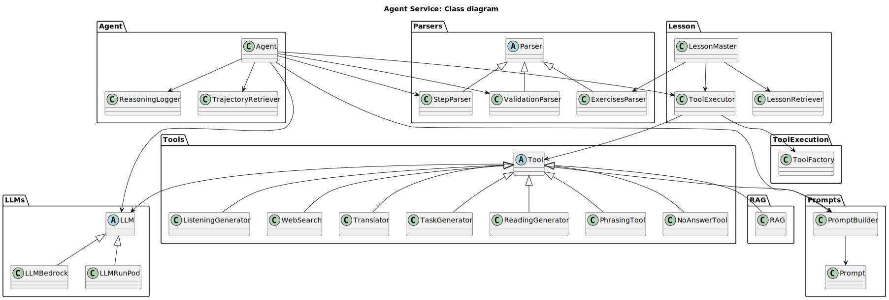

# Agent Microservice Overview

The Agent Microservice is a Python-based service designed to perform specialized tasks such as LLM-driven question-answering, lesson & exercises creation. This microservice processes user queries, performs reasoning, and uses various tools to generate responses.

## Responsibilities

- Processing complex queries and generating answers using tools like text translation, web search, and phrasing support.
- Generating reading & listening for German learning.
- Retrieving the grammar explanations. 
- Generating & validating the exercises for German learning.
- Retrieving relevant documents on legal and political aspects, generating an answer based on retrieved information.

## Services Interacted With

- **API Gateway**: Routes requests from clients to the agent microservice.
- **Curriculum Microservice**: Provides lessons and exercises for curriculum-related queries.

## Agent Microservice Architecture

The architecture of the Agent Microservice is illustrated in the following diagram:



## Components
### Entry point
**FlaskApp**: The main application handling HTTP requests.

### Agent
Performs the reasoning and query processing for queries related to German learning.


### Retrieval-Augmented Generation
Retrieval-Augmented Generation for handling queries related to law and politics.


### LessonMaster 
Manages lesson & exercise generation on a defined topic.


# Agent Microservice Setup

## Prerequisites

- Python 3.10+
- pip

## Steps

1. Clone the repository:
    ```sh
    git clone https://github.com/a-kholmovaia/aika.git
    ```

2. Navigate to the agent-microservice directory:
    ```sh
    cd backend/agent-microservice/src
    ```

3. Install dependencies:
    ```sh
    pip install -r requirements.txt
    ```

6. Initialize the vector store:
    ```sh
    python -m scripts.init_milvus_db
    ```

6. Run the service:
    ```sh
    flask run
    ```