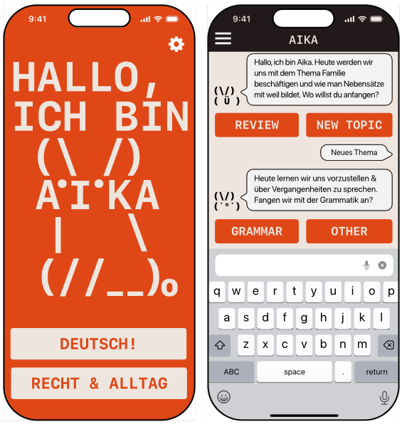

# Kurzbeschreibung

AIKA ist eine KI-gestützte Sprachlern-App, die als Ersatz oder zur Unterstützung der früheren Stufen des Integrationskurses für Migrant:innen eingesetzt werden kann. 

## Motivation

Es liegt im Interesse aller, dass sich die geflüchteten Menschen so schnell wie möglich in die Gesellschaft und den Arbeitsmarkt integrieren können. Die durchschnittliche Wartezeit auf einen Integrationskurs betrug im Jahr 2023 jedoch mehr als 5 Monate (laut dem Bundesrechnungshof). Das ist eine Zeit, in der Geflüchtete nur auf ein Angebot für einen Kursplatz warten müssen. Auch im Bereich der rechtlichen Bildung mangelt es an Personal und unzugänglichen Angeboten, die wiederum vielen Menschen das Leben in Deutschland erschweren und die Arbeit der Sozialarbeiter:innen ineffizient gestalten.

## Implementierung

Der Nutzer interagiert mit AIKA hauptsächlich über einen Chat, in dem er mit einem Bot kommuniziert, dessen Antworten mit Hilfe von LLMs generiert werden, die auf dem Server laufen. 

Beispiel von möglichen UI

AIKAs Curriculum besteht aus drei Teilen: Sprache, Recht und Alltag. 

### Sprache

Das Curriculum entspricht dem Sprachniveau A2.1 und zielt auf die Verbesserung der Fertigkeiten Schreiben, Hören und Lesen ab. Zu einem späteren Zeitpunkt soll auch Sprechen einbezogen werden. 

Das Curriculum zu bewältigen, hilft dem Nutzer das Intelligent Tutoring System von AIKA, die den Lernprozess an die Bedürfnisse des Nutzers anpasst, indem es den aktuellen Fortschritt des Nutzers bewertet und passende Aufgaben generiert. 

### Recht und Alltag

Dieser Teil erleichtert den Integrationsprozess des Nutzers in Bezug auf alltägliche Aktivitäten und Bürokratie in Deutschland. Der Nutzer kann AIKAs ChatBot Fragen stellen, z.B. zur Mülltrennung oder zum Ausfüllen eines Antrags, und die Antworten, die von fine-tuned LLMs generiert werden, im Chat lesen. 

